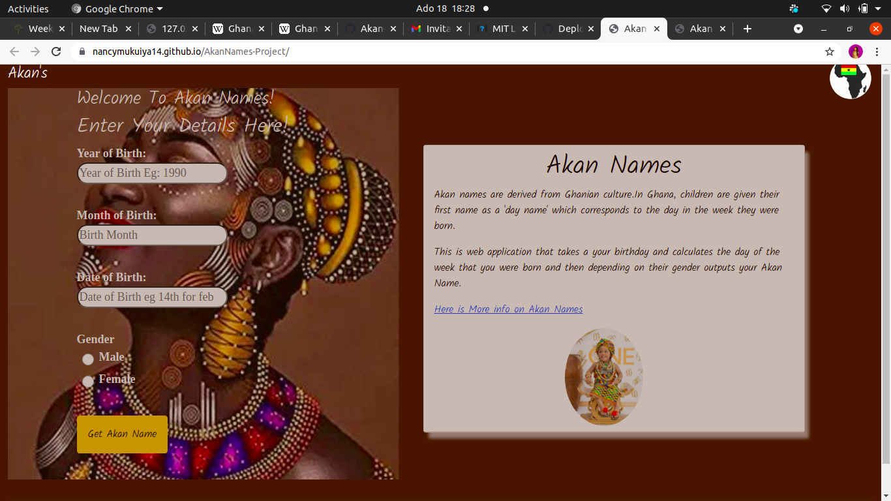
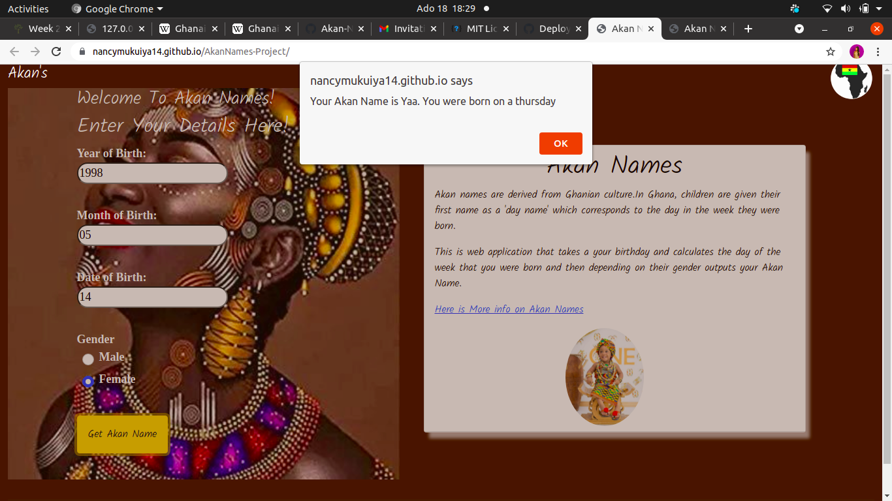

## Author of the project :Nancy Kigotho.
## Project Name :Akan Names.
## Description.
*  This is a web application that takes your birthday date,month and year and calculates the day of the week that you were born and then depending on their gender outputs your Akan Name.
## Instructions.
* Enter a valid year of birth.
* Enter a valid month of birth.
* Enter a valid date of birth.
* select your gender.
* Click on the button to get your Akan name.
## Technologies Used.
* HTML.
* CSS.
* Javascript.
## Contact Information.
* if you have any questions about the project please contact me via nancykigotho14@gmail.com.
## Requirements.
* Github.
* Git.
* web browser.
## Github link.
Below is a link to view the project.
https://nancymukuiya14.github.io/AkanNames-Project/

## Images.

## Licence.
Copyright <YEAR> <COPYRIGHT HOLDER>

Permission is hereby granted, free of charge, to any person obtaining a copy of this software and associated documentation files (the "Software"), to deal in the Software without restriction, including without limitation the rights to use, copy, modify, merge, publish, distribute, sublicense, and/or sell copies of the Software, and to permit persons to whom the Software is furnished to do so, subject to the following conditions:

The above copyright notice and this permission notice shall be included in all copies or substantial portions of the Software.

THE SOFTWARE IS PROVIDED "AS IS", WITHOUT WARRANTY OF ANY KIND, EXPRESS OR IMPLIED, INCLUDING BUT NOT LIMITED TO THE WARRANTIES OF MERCHANTABILITY, FITNESS FOR A PARTICULAR PURPOSE AND NONINFRINGEMENT. IN NO EVENT SHALL THE AUTHORS OR COPYRIGHT HOLDERS BE LIABLE FOR ANY CLAIM, DAMAGES OR OTHER LIABILITY, WHETHER IN AN ACTION OF CONTRACT, TORT OR OTHERWISE, ARISING FROM, OUT OF OR IN CONNECTION WITH THE SOFTWARE OR THE USE OR OTHER DEALINGS IN THE SOFTWARE.